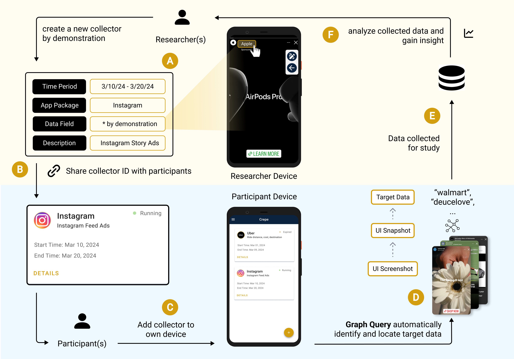

# CREPE

Crepe is an Android application designed to help academic researchers collect data displayed on mobile screens. It's an app developed by the [SaNDwich Lab](https://toby.li/). Crepe is built on top of the accessibility service provided by Android to collect data on Android app.

Using a programming by demonstration (PBD) paradigm, Crepe enables researchers to collect specific data by simply tapping on the target data on the screen.

## Features

- **Graph Query Technology:** Utilize a custom query language to flexibly and accurately identify and locate target data on UI screens.
- **Low-Code Interface:** Enable researchers to specify what data to collect through simple no-code demonstrations.
- **Low-battery Impact:** Minimize its impact on device battery life, ensuring that data collection can proceed for extended periods without significantly affecting the daily usage of participant devices.
- **Collector Sharing with CollectorID:** Researchers can share the collector with the participants simbly by sharing the collectorID.

## Term Explained

### GraphQuery

GraphQuery is composed of 'Graph' and 'Query'.

In this folder, we create an abstract layer to expand details about current UI Elements. Based on the basic information, we define node, variable and block to form a graph that shows the relationships among these UI elements. This relationships could be represented in spatial, hierarchical and functional structures. In this graph, we also adds some new attributes of the UI Elements 

In addition, we define a set of criteria about how the query could work. This includes:
1. logical expression like `AND`, `OR`, etc.
2. Filtering logic like `ARG_MIN`, `ARG
MAX` and `EXISTS` etc.
3. Relation logic like `HAS_TEXT`, `IS_CLICKABLE` and `RIGHT_OF` etc.
4. Simplest Query with specific relations and entities.
5. Subqueries
6. PlaceholderQuery for the need to dynamically modify the structure of an existing query.

Based on the graph and query part, we could form a UISnapShot that captures a snapshot the current state of the UI Interface. The data structure contains a subject, predicate and object. For example, `Button X has text 'Submit'` or `Image Y is to the right of Text Z`. With this snapshot, we could analyze or interact with the UI programmatically. To be specific, we could use machine language to explain what users perceive or explain(This is the natural language)

### Demonstration

The demonstration is mainly to confirm the data that we want to collect and figure out the reason why the user want to collect this data.

In the demonstration process, the system could generate `GraphQuery` through users' `tap` interaction with the User Interface. When the user tap a text, the system will create a UISnapshot that shows all the attributes and possible relationships regarding the UI Element where the text stands for. After users write a description about their purpose, we ask generative AI to tell which relationships match the purpose. For example, the purpose of tapping the first element in the list(the element name is `Black Coffee`) and tapping the names that contains `Black coffee` is different. The first one could be interpreted as the fact that the user just want to select the top recommended coffee. But the second one could be interpreted as the fact that the user just want to drink black coffee.

## Setup

To use this app, the suggested Android Version is `9.0.0+`. If running for the first time, you need to login into the app with a `Google Account`.

## Privacy Policy

This app is mainly used for research purposes. Before using this app to collect data on users' devices, researchers should inform the users what data they want to collect.

## Contact us

Please feel free to contact Yuwen Lu at ylu23@nd.edu if you have any question.

